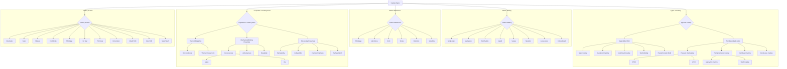

# Comprehensive Casting Topics Flowchart

This flowchart visually represents the specific casting topics outlined by the user.

```mermaid
graph TD
    A[Casting Topics] --> B{Types of Casting};
    A --> C{Pattern Making};
    A --> D{Pattern Allowances};
    A --> E{Properties of Casting Sand};
    A --> F{Casting Defects};

    subgraph Types of Casting
        B --> B1[Expendable Mold];
        B1 --> B1a[Sand Casting];
        B1 --> B1b[Investment Casting];
        B1 --> B1c[Lost Foam Casting];
        B1 --> B1d[Shell Molding];
        B1 --> B1e[Plaster/Ceramic Mold];

        B --> B2[Non-Expendable Mold];
        B2 --> B2a[Pressure Die Casting];
        B2a --> B2a_1[HPDC];
        B2a --> B2a_2[LPDC];
        B2 --> B2b[Permanent Mold Casting];
        B2b --> B2b_1[Gravity Die Casting];
        B2b --> B2b_2[Slush Casting];
        B2 --> B2c[Centrifugal Casting];
        B2 --> B2d[Continuous Casting];
    end

    subgraph Pattern Making
        C --> C1[Single-piece];
        C --> C2[Multi-piece];
        C --> C3[Match plate];
        C --> C4[Gated];
        C --> C5[Sweep];
        C --> C6[Skeleton];
        C --> C7[Loose piece];
        C --> C8[Follow board];
    end

    subgraph Pattern Allowances
        D --> D1[Shrinkage];
        D --> D2[Machining];
        D --> D3[Draft];
        D --> D4[Shake];
        D --> D5[Distortion];
        D --> D6[Moulding];
    end

    subgraph Properties of Casting Sand
        E --> E1[Thermal Properties];
        E1 --> E1a[Refractoriness];
        E1 --> E1b[Thermal Conductivity];

        E --> E2[Mechanical/Binding Properties];
        E2 --> E2a[Cohesiveness];
        E2a --> E2a_1[Green];
        E2a --> E2a_2[Dry];
        E2 --> E2b[Adhesiveness];
        E2 --> E2c[Flowability];

        E --> E3[Processing Properties];
        E3 --> E3a[Permeability];
        E3 --> E3b[Collapsibility];
        E3 --> E3c[Chemical Inertness];
        E3 --> E3d[Surface Finish];
    end

    subgraph Casting Defects
        F --> F1[Blowholes];
        F --> F2[Scab];
        F --> F3[Misruns];
        F --> F4[Cold Shuts];
        F --> F5[Shrinkage];
        F --> F6[Hot Tear];
        F --> F7[Pin Holes];
        F --> F8[Penetration];
        F --> F9[Mould Shift];
        F --> F10[Core Shift];
        F --> F11[Sand Wash];
    end
```