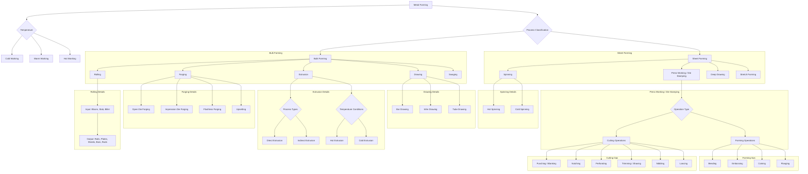

# Metal Forming Processes Flowchart

This flowchart outlines the various metal forming processes as described in the reference documents.

## Detailed Breakdown

### 1. Metal Forming Introduction
- **Based on Temperature**:
    - **Cold Working**:
        - Done at or slightly above room temperature.
        - **Pros**: Good tolerances, surface finish, increased strength.
        - **Cons**: High force required, limited formability due to strain hardening.
    - **Warm Working**:
        - Done between room temperature and recrystallization temperature.
        - **Pros**: Lower forces, enhanced deformation properties.
    - **Hot Working**:
        - Done above the recrystallization temperature.
        - **Pros**: Significant deformation, lower forces, no work hardening.
        - **Cons**: Poor surface finish, lower accuracy, shorter tool life.

### 2. Process Classifications

#### A. Bulk Forming Processes
*(Significant change in shape, small surface-area-to-volume ratio)*

- **Rolling**: Reducing thickness by compressing material between rolls.
    - **Inputs**: Blooms, Slabs, Billets.
- **Forging**: Shaping material by compressing it between dies.
    - **Types**:
        1.  **Open Die**: Material flows freely.
        2.  **Impression Die**: Dies contain a cavity, creating a shape and "flash".
        3.  **Flashless**: Material is fully contained within the die.
        4.  **Upsetting**: Increasing diameter by reducing length (often for heads on bolts/nails).
- **Extrusion**: Pushing material through a die to create a cross-sectional shape.
    - **Process Types**:
        1.  **Direct Extrusion**: Billet is pushed through the die.
        2.  **Indirect Extrusion**: Die moves against the billet, reducing friction.
    - **Temperature Conditions**:
        1.  **Hot Extrusion**: Done above recrystallization temperature to reduce force and increase ductility.
        2.  **Cold Extrusion**: Done at room temperature for stronger products with better finish.
- **Drawing**: Pulling material through a die to reduce its cross-section.
    - **Types**:
        1.  **Bar Drawing**: For large-diameter bars.
        2.  **Wire Drawing**: For small-diameter wire, often continuous through multiple dies.
        3.  **Tube Drawing**: To reduce tube diameter/wall thickness.
- **Swaging**: Reducing the diameter of a tube or rod by repeated radial blows from rotating dies.

#### B. Sheet Forming Processes

- **Deep Drawing**: Forming cup-shaped parts by pushing a sheet metal blank into a die opening with a punch.
- **Press Working (Die Stamping)**: Cutting or forming sheet metal using a press machine with a dedicated punch and die.
    - **Categories**:
        1.  **Cutting Operations** (Stress exceeds shear strength):
            - **Punching/Blanking**: Separating material from a sheet.
            - **Notching**: Cutting from the edge of a sheet.
            - **Perforating**: Punching multiple holes.
            - **Trimming**: Removing excess material.
            - **Shaving**: Improving edge accuracy on a blanked part.
            - **Nibbling**: Cutting contours with a series of overlapping punches.
            - **Lancing**: Simultaneously cutting and bending or forming.
        2.  **Forming Operations** (Stress is below shear strength):
            - **Bending**: Creating bends and angles (e.g., V-bending, edge bending).
            - **Embossing**: Creating raised or recessed designs without changing thickness.
            - **Coining**: High-pressure forming to impart fine details.
            - **Flanging**: Creating a flange or flare.
- **Stretch Forming**: Sheet metal is simultaneously stretched and bent over a die or form block to create large contoured parts.
- **Spinning**: Forming an axisymmetric part by pressing a sheet/plate over a rotating mandrel.
    - **Types**:
        1.  **Hot Spinning**: For thick materials.
        2.  **Cold Spinning**: For thin, soft materials.
