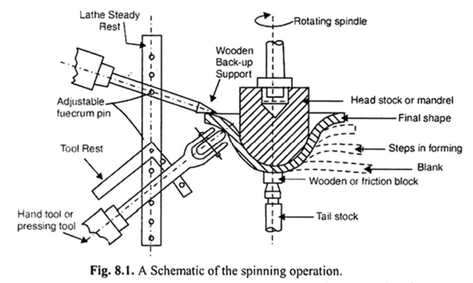

# Metal Forming

Metal forming processes are used to produce structural parts and components that have widespread applications in many industries including automobile, aerospace, and appliances. During the Forming process, the metal is plastically deformed by a force that exceeds the material yield strength where strain hardening occurs.

## Working Temperatures

### Cold working
- Done at room temperature or slightly above.
- **Advantages:** Closer tolerances, good surface finish, higher strength and hardness, desirable directional properties, minimized energy costs, near-net-shape forming.
- **Disadvantages:** Higher forces and power required, limits amount of forming, not for non-ductile workpieces.

### Warm working
- Performed at temperatures just above room temperature but below the recrystallization temperature (0.3 times the melting point).
- **Advantages:** Enhanced plastic deformation, lower forces required, intricate geometries possible, reduced annealing stages.

### Hot working
- Involves deformation above recrystallization temperature (between 0.5Tm to 0.75Tm).
- **Advantages:** Significant plastic deformation, significant shape change, lower forces, can form materials with premature failure, no work hardening.
- **Disadvantages:** Shorter tool life, poor surface finish, lower dimensional accuracy, sample surface oxidation.

# Classification of Metal Forming Processes

## Bulk forming
A severe deformation process resulting in massive shape change. The surface area-to-volume of the work is relatively small and bulk forming is mostly done in hot working conditions. Basic bulk deformation processes:
(a) Rolling, (b) forging, (c) Extrusion, (d) Drawing (e)spinning

## Rolling
A metal forming process in which the thickness of the work is reduced by compressive forces exerted by two rolls rotating in opposite direction.

-   **Bloom:** It has a square cross section 150 mm x 150 mm or more. Blooms are rolled into structural shapes like rails for railroad tracks.
-   **Slab:** It is rolled from an ingot or a bloom and has a rectangular cross section of 250 mm width or more and thickness 40 mm or more. Slabs are rolled into plates, sheets, and strips.
-   **Billet:** It is rolled from a bloom and is square in cross-section with dimensions 40mm on a side or more. Billets are rolled into bars, rods.

## Forging
A deformation process in which the work piece is compressed between two dies, using either impact load or hydraulic load to deform it.

### i) Open die forging
The work piece is compressed between two flat platens or dies, thus allowing the metal to flow without any restriction in the sideward direction relative to the die surfaces.

### ii) Impression die forging
The die surfaces contain a shape that is given to the work piece during compression, thus restricting the metal flow significantly. There is some extra deformed material outside the die impression which is called as flash. This will be trimmed off later.

### iii) Flashless forging
The work piece is fully restricted within the die and no flash is produced. The amount of initial work piece used must be controlled accurately so that it matches the volume of the die cavity.

## Extrusion
A bulk forming process in which the work metal is forced or compressed to flow through a die hole to produce a desired cross-sectional shape.

### i) Direct extrusion
A metal billet is first loaded into a container having die holes. A ram compresses the material, forcing it to flow through the die holes. Significant friction exists between the billet surface and the container walls.

### ii) Indirect extrusion
The die is mounted to the ram and not on the container. As the ram compresses the metal, it flows through the die hole on the ram side which is in opposite direction to the movement of ram. No friction at the interface, and hence the ram force is lower.

## Wire drawing
A wire, rod, bar are pulled through a die hole reducing their cross-section area.

## Tube drawing
This operation is used to reduce the diameter or wall thickness of the seamless tubes and pipes. Can be done with or without a mandrel.

## Spinning
A sheet metal forming process in which a metal blank is pressed over a rotating chuck or form mandrel with the help pressing tool to obtain axisymmetric hollow shell.

### Spinning Machines
Any heavy duty lathe with adequate speed range can be used for spinning process.

### Spinning Tools
The spinning or forming tools are made from brass, bronze or steel to a variety of radii.

