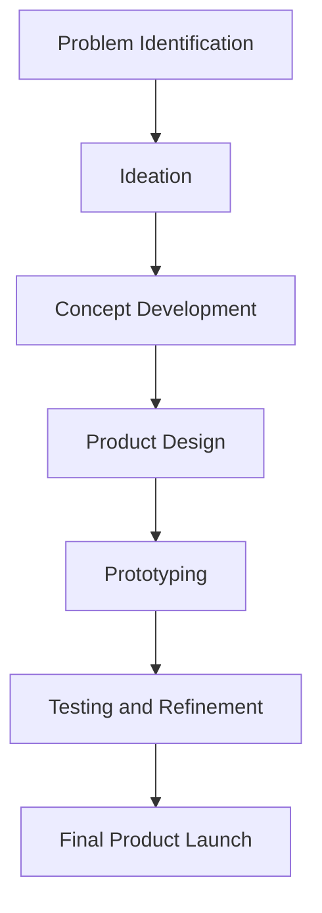

# Ideation, Product Design, and Prototyping

## Introduction to Ideation

**Definition:** The creative process of generating, developing, and communicating new ideas. It is the foundation of innovation and involves brainstorming, visualization, and evaluation.

### Purpose
*   Generate multiple potential solutions.
*   Encourage "out-of-the-box" thinking.
*   Identify the most promising ideas.
*   Align with product concepts.

### Characteristics of Good Ideation
*   User and problem-focused.
*   Encourages diversity of thought.
*   Focuses on both quality and quantity of ideas.
*   Iterative and collaborative in nature.

### Steps in Ideation

| Step                      |
| ------------------------- |
| Problem Identification    |
| Research and Insight      |
| Brainstorming/Idea Generation |
| Idea Evaluation           |
| Concept Development       |
| Prototyping               |
| Refinement                |

### Popular Ideation Techniques

*   **Brainstorming:** A group creativity technique used to generate a large number of diverse ideas in a short period. Participants are encouraged to share all ideas without criticism.
*   **Mind Mapping:** A visual thinking tool that helps to structure information, helping you to better analyze, comprehend, synthesize, recall, and generate new ideas. You start with a central theme and branch out with related concepts.
*   **SCAMPER Method:** A checklist of questions that encourages a systematic approach to creative thinking.
    *   **S**ubstitute: What can be replaced?
    *   **C**ombine: What can be combined?
    *   **A**dapt: What can be added?
    *   **M**odify: What can be modified?
    *   **P**ut to another use: Can it be used elsewhere?
    *   **E**liminate: What can be removed?
    *   **R**everse: What can be rearranged?
*   **Design Thinking Workshops:** Structured, human-centered workshops that focus on understanding user needs and rapidly generating and testing ideas.
*   **Sketching and Storyboarding:** Visual methods to represent ideas. Sketching is about drawing ideas, while storyboarding illustrates a user's experience with a product or service.

## Product Design

**Definition:** The process of imagining, creating, and iterating products that solve users’ problems or address specific needs in a given market.

### Objectives of Product Design
*   **Aesthetics:** The visual appeal and look and feel of the product.
*   **Ergonomics:** Designing for ease of use and human comfort.
*   **Innovative:** Introducing new ideas, methods, or features.
*   **Functional:** The product must work and perform its intended task effectively.
*   **User-Friendly:** The product should be easy and intuitive to use.
*   **Easy to Make:** The design should allow for efficient and cost-effective manufacturing.
*   **Cost-Effective:** The product should be profitable and affordable for the target market.
*   **Enhance User Satisfaction:** The overall experience with the product should be positive.

## Product Development Process

The product development process includes ideation, design, engineering, prototyping, testing, and market launch.

### Stages of Product Development
1.  Idea Generation
2.  Idea Filtering/Screening
3.  Testing/Concept Development
4.  Business Analysis
5.  Product Design and Engineering
6.  Prototype Development
7.  Testing and Validation
8.  Production/Commercialization

### Cross-Functional Nature
Product development requires collaboration among different professionals, including designers, engineers, marketers, and business strategists.

## Introduction to Prototyping

**Definition:** An early sample, model, or release of a product built to test a concept or process.

### Purpose of Prototyping
*   Evaluate and test the design.
*   Detect design flaws early.
*   Gather user feedback.
*   Validate manufacturing feasibility.

### Types of Prototyping
*   **Proof of Concept (PoC):** A small exercise to test a design idea or assumption. It is used to verify that a concept is technically feasible.
*   **Form Study Prototype:** A model that allows designers to explore the basic size, look, and feel of a product, without worrying about function.
*   **Functional Prototype:** A prototype that is created to test the functions of a product. It looks and works like the final product.
*   **Pre-production Prototype:** The final version of the prototype before production begins. It is used for final testing and refinement.

### Prototyping Methods
*   **Manual:** Handcrafting models using materials like clay, foam, or wood.
*   **Digital:**
    *   **CAD (Computer-Aided Design):** Creating 2D and 3D models of the product.
    *   **Simulation:** Using software to test the product's performance in a virtual environment.
*   **Rapid Prototyping (RPT):**
    *   **3D Printing:** Additive manufacturing process.
        *   **FDM (Fused Deposition Modeling)**
        *   **SLA (Stereolithography)**
        *   **SLS (Selective Laser Sintering)**

## Relationship between Ideation, Product Design, and Prototyping

## Tools Used

### Ideation
*   Brainstorming
*   SCAMPER
*   Mind Mapping

### Product Design
*   **CAD (Computer-Aided Design):** Software used to create 2D and 3D models.
    *   *SolidWorks*
    *   *CATIA*
    *   *Creo*

### Development & Simulation Tools
*   **ANSYS:** Engineering simulation software.
*   **MATLAB:** A programming and numeric computing platform.
*   **Fusion 360:** Cloud-based 3D modeling, CAD, CAM, CAE, and PCB software.

### Prototyping
*   **3D Printing:** FDM, SLA, SLS
*   **CNC Machining:** Subtractive manufacturing process.
*   **Mock-ups:** Scale or full-size model of a design.

## Advantages of Effective Ideation and Prototyping

*   **Reduced Development Time:** Early identification of ideas and flaws speeds up the process.
*   **Lower Costs:** Fixing errors in the early stages is cheaper than in later production stages.
*   **Early Detection of Errors:** Prototyping helps to find and fix issues before the product is mass-produced.
*   **Improved Quality:** Iterative feedback and refinement lead to a better final product.
*   **Better User Experience:** User feedback helps create products that are more intuitive and satisfying to use.
